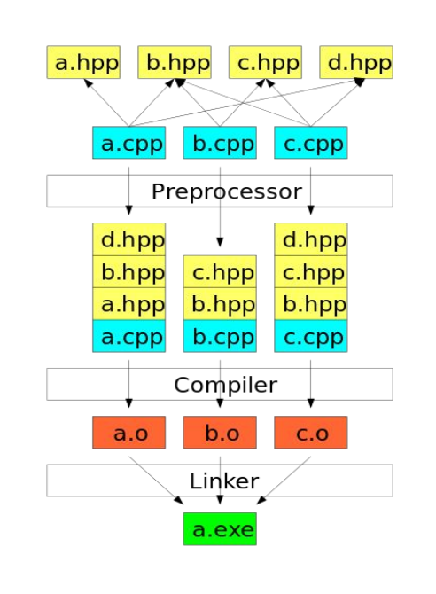

### Compilation
> 10. Компиляция, этапы, ошибки компиляци.

**Программы** состоят из *файлов*. Для чего программу разбивают на *файлы*:
- Логическое разбиение на **модули** (легче работать с кодом).
- Повторное использование некоторых кусков кода.
- Ускорение процесса компиляции.
- Небольшие файлы проще читать и редактировать.
- Есть два типа файлов.
	- Заголовочные `.h` , `.hpp`.
	- С исходным кодом `.cpp`.

> **Заголовочные** файлы в языке программирования ***C++*** содержат:
> - *Function* ***declaration*** & ***definition***
> - *Variable* ***declaration***
> - *Type* ***declaration***
> - **Static** *variable* ***definition*** & ***declaration***
> - *Class* and *structs* ***definition*** & ***declaration*** 
> - …
> 
> Пример **заголовочного** файла:
> ```Cpp
> #pragma once
> 
> int add(int a, int b);
> 
> const static float PI = 3.14;
> 
> int some_value;
> ```
> 
> Файлы **кода** содержат исходный код, написанный на *объектно-ориентированном* языке программирования ***C++***.

<br>

# Определения:
1. ***Трансляция*** <mark>translation</mark>- **преобразование** *программы*, представленной на одном из *языков программирования* (**исходный язык** <mark>source language</mark>), в программу на другой *язык* (**целевой язык** <mark>target language</mark>) и, в определённом смысле, **равносильную первой**.
   
2. ***Транслятор*** <mark>translator</mark> - *программа* или *устройство*, которое выполняет ***трансляцию***.
   
3. ***Исходный код*** <mark>source code</mark> - *фрагмент текста*, написанный на **исходном языке** для некоторого ***транслятора***, “программа” как *текст*.
   
4. ***Единица трансляции*** <mark>translation unit</mark> - *файл исходного кода*, обрабатываемый ***транслятором*** как единое целое. В случае *языка* ***C++*** ***единица трансляции*** (*файл* `.cpp`) является **модулем**.
   
5. ***Интерпретация*** <mark>interpreting</mark> - *построчный анализ, *обработка* и *выполнение* **исходного кода** *программы* или *запроса*.
   
6. ***Интерпретатор*** <mark>interpreter</mark>:
	 - *программа* или *устройство*, которое выполняет ***интерпретацию***.
	 - ***транслятор***, *целевым языком* которого является ***множество действий***.  
	   
7. ***Компиляция*** <mark>compilation</mark>:
	  - преобразование *программы*, представленной на одном из *языков програмирования* в *программу* на более **низком** коде, близком к *машинному*, который может быть непосредственно выполнен **процессором**.
	  - ***трансляция***, результатом которой является *машинный код*, который может  быть непосредственно выполнен **процессором**. 
	  - ***трансляция***, результатом которой является *файл* на нектором **целевом языке**. В ряде случаев этот *файл* готов к **запуску** в некоторой **среде исполнения** (**операционной системе** или на **виртуальной машине**). В дургих случаях требуется ***компановка*** (процесс **связывания** с другими *фрагментами кода*).

8. ***Компилятор*** <mark>compiler</mark> - *программа* или *устройство*, которое выполняет ***компиляцию***.
>Если для ***компилятора*** помимо собственно **целевого языка** имеет значение способ оформления **результирующих файлов** и иные особенности **операционной среды** (обычно задаваемые выбором **целевой ОС**), то говорят о ***целевой платформе***. Если ***целевая платформа*** не совпадает c (не является **надмножеством**) *платформой*, на которой запущен сам **компилятор**, то процесс такой компиляции называется **кросс-компиляцией** (например, на *GNU/Linux* компилируется код, который будет затем запускаться на *Windows*).

9. ***Раздельная компиляция*** <mark>separate compilation</mark> - ***компиляция*** **единиц трансляции** по *отдельности независимо друг от друга* (в *произвольном порядке*, в том числе *параллельно*). Какая-то часть из них может быть **откомпилирована** заранее. В случае ***C++*** это означает *независимую* **компиляцию** разных `.cpp` *файлов*, включенных в проект. Когда все **единицы трансляции** *скомпилированы*, можно выполнить их *компоновку* в конечный продукт — например, *исполняемый файл*.
   
10. ***Ассемблер*** <mark>assembler</mark> - ***транслятор***, *исходным языком* которого является **стандартизованная текстовая форма** *машинного кода* (удобного для человека, - **ассемблерный код** <mark>assembly</mark>), а *целевым языком* — **машинный код**.
> Ассемблер можно считать видом ***компилятора***, но традиционно термин “***компилятор***” применяется только по отношению к ***трансляторам*** с *исходных языков* **высокого уровня**.

11. ***Дизассемблер*** <mark>disassembler</mark> - ***транслятор***, *исходным языком* которого является **машинный код**, а *целевым языком* — **ассемблерный код**. ***Дизассемблеры***, как правило, принимают на вход *исполняемые файлы* и *библиотеки* в **машинном коде**.

12. ***Объектный файл*** <mark>object</mark> - результат работы ***компилятора*** в случае использования отдельной **программы-компоновщика**. Как правило, содержит специальным образом оформленный **машинный код** (***объектный код*** <mark>object code</mark>).
> “**Object code**” тоже можно перевести как “**целевой код**”, и он действительно является целевым для **компилятора**. Однако такой перевод может вызвать путаницу с точки зрения разделения “*целевого языка*” вообще или фрагмента программы на этом *языке* и промежуточного *файла*, принимаемого **компоновщиком** (см. ниже) — “**объекта**”.
> 
> Исторически слово “<mark>object</mark>”, вероятно, связано с *языком* [BCPL](https://ru.wikipedia.org/wiki/BCPL), который можно считать предком *языка* ***C***. **Компилятор** *BCPL* **транслировал** программы на *BCPL* в *файлы* на специальном промежуточном *языке низкого уровня* [O-code](https://en.wikipedia.org/wiki/O-code) (“**object code**” — “*целевой код*”), которые уже затем могли **транслироваться** в *исполняемые файлы* для конкретных **ОС** и **процессоров** отдельными ***трансляторами***. Такой подход облегчал перенос **компилятора** на новые системы: сам **компилятор** можно было не трогать, достаточно было обновить (или написать новый) ***транслятор*** *O-code*. [Данный подход](https://ru.wikipedia.org/wiki/%D0%91%D0%B0%D0%B9%D1%82-%D0%BA%D0%BE%D0%B4) затем применялся неоднократно (например, для *Pascal*, *Basic*, *Java*, *.NET*).

13. ***Машинный код*** <mark>machine code</mark> - *язык*, **интерпретатором** которого является некоторый **процессор** (“*машина*”).

14. ***Компановка*** <mark>linking</mark> - построение готового к запуску *исполняемого файла*, либо стандартным образом оформленной *библиотеки* в машинном коде из набора **объектных файлов**, **библиотек** в **машинном коде**, а также любых дополнительных данных. 

15. ***Компоновщик*** <mark>linker</mark> - *программа*, выполняющая **компановку**.

16. ***Исполняемый файл*** <mark>executable</mark> - оформленная в виде *файла стандартного формата* (для определённой **ОС**) *программа* в машинном коде, которую можно **немедленно** *запустить* на исполнение.
> - В **ОС Windows** *исполняемые файлы* традиционно помечаются разрешением **exe**.
>  - В **maсOC** и **iOS** используется формат **Mach-O**.
>  - В **Linux** нет расширений *файлов*, но для удобства исполняемые *файлы* помечаются разрешением `.exe`.

17. ***Модуль*** <mark>module</mark>:
	- Специальным образом оформленная *единица исходного кода*, задающая **свою область видимости**. Во многих *языках* (включая ***C***, с той поправкой, что интерфейс модуля предоставляется в виде отдельного *заголовочного файла*) совпадает с **файлом исходного кода** и **единицей трансляции**. Такой ***модуль*** может иметь *имя*, доступное из программы (*например*, **юнит** в *Pascal*, в ***C*** — просто *имя заголовочного файла*, используемое в **директиве** `include`).
	- **Единица трансляции**.
	- В *операционных системах*: стандартным образом оформленный *машинный код* (**набор процедур**), возможно, с внедрёнными данными - **ресурсами** <mark>resources</mark>. *Исполняемый файл* и *динамически связываемая библиотека* — примеры ***модулей***.

18. ***Сборка*** <mark>building</mark> - **полный** многоэтапный процесс порождения *исполняемых файлов* (*модулей*) из **файлов исходного кода**, **библиотек** и **файлов ресурсов**.
> Необходимый для ***сборки*** конкретный **набор программ** называют (это распространённый жаргонизм) ***тулчейном*** <mark>toolchain</mark>. Обычно это **компилятор** и **компоновщик**. Нередко в состав ***тулчейна*** добавляют **отладчик**. Естественно, **отладчик** не задействуется в **процессе сборки** непосредственно, однако, если мы хотим эффективно применять некоторый **отладчик** к результирующему *машинному коду*, то поддержка этого **отладчика** должна быть заложена уже на этапе **сборки**. Конкретные реализации *стандартных библиотек* также могут включаться в ***тулчейн*** (просто потому, что любая реализация *языка* обязана поддерживать его *стандартную библиотеку*).

19. ***Объявление*** <mark>declaration</mark> - **языковая конструкция**, заявляющая о наличии среди используемых в сборке **единиц трансляции** и **библиотек** некоторой **сущности** (*глобальной переменной*, *функции*, *типа*) и предоставляющая **компилятору** необходимый минимум сведений об этой сущности.
> В частности, объявление функции состоит из заголовка функции, что позволяет компилятору оформить вызов функции в объектном коде. А уже на этапе компоновки будет достаточно проставить реальный адрес вызываемой функции.

```Cpp
// declaration
int add(int a, int b);
```

20. ***Определение*** <mark>definition</mark> - **полное** описание некоторой **сущности** (*переменной*, *функции*, *типа* ...) на *языке программирования*.
```Cpp
//definition
int add(int a, int b) { return a + b; }
```

21. ***Правило одного определения*** <mark>one definition rule, ODR</mark> в C++:
	1. Любая *(глобальная)* *сущность* может быть **определена** лишь ***однажды***.
	2. Любая **локальная** *сущность* может быть определена лишь **однажды** в ***своей области видимости***.
> Программа, нарушающая первую часть ODR может быть скомпилирована без ошибок, но привести к ошибкам компоновки. Программа, нарушающая вторую часть ODR приведёт к ошибкам компиляции.

22. ***Библиотека*** <mark>library</mark> -  самостоятельный *фрагмент кода*, предназначенный для использования в составе другого *ПО*.
> ***Библиотека*** может существовать как в *исходном коде*, подключаемом во время **компиляции** и **транслируемом** вместе с кодом *ПО*, использующего *библиотеку*, так и в специально оформленном машинном коде (“модуле”), подключаемом либо во время **компоновки** (**статические библиотеки** <mark>static libraries</mark>), либо во время работы *ПО* (**динамически связываемые библиотеки** <mark>dynamically linked libraries, DLL</mark>, <mark>shared objects, SO</mark>).

23. ***Точка входа*** <mark>entry point</mark> - **адрес** в **модуле** (*исполняемом файле* или *библиотеке*), с которого можно начать выполнение кода.
> **Адрес** может иметь символическое *имя*, записанное в **специальной таблице** внутри модуля. Часто это *имя* просто совпадает с *именем* соответствующей *функции* в исходном коде. В ***C++*** определена стандартная ***точка входа*** для *исполняемых файлов* — *функция* ***main***.


# <u>Этапы трансляции</u>
## Основные этапы
| Этапы                                                  | Пример                                                   |
|----------------------------------------------------------------------|----------------------------------------------------------|
| 1. ***Препроцессор***<br>2. ***Компоновщик***<br>3. ***Линковщик***                   |           |

***Компиляторы*** умеют запускать *этапы трансляции* по отдельности (на примере **clang**):
- ***clang++ -E*** - run *preprocess*
- ***clang++ -S*** - run *preprocess* and *compilation* steps
- ***clang++ -c*** - run *preprocess*, *compile*, and *assemble* steps
- ***clang++ --Xlinker*** - run *linker*

## Препроцессор
- ***Язык препроцессора*** – это **специальный** язык программирования, встроенный в ***C++***.
- **Лексический** анализ кода.
- Команды языка ***препроцессора*** называют **директивами**, все **директивы** начинаются со знака #.
- *Директива* `#include` позволяет подключать **заголовочные** файлы к **файлам кода**.
- ***Препроцессор*** заменяет *директиву* `#include "bar.h"` на содержимое файла `bar.h`.
- *Директивы* ***препроцессора***:
	1. `#define` и `#unded (__FILE__, __LINE__, …)`
	2. `#` and `##` operators.
	3. Условное включение (`#if`, `#ifdef`, `#ifndef`, `#elif`, `#else`, `#endif`).
	4. `#include`
		- `#include <filename>`
		- `#include "filename"`
	5. `#pragma once`
	6. `#error`
	7. etc.
	
### Макросы
- ***Макросами*** в ***C++*** называют **инструкции препроцессора**.
- **Препроцессор** ***C++*** является ***самостоятельным*** языком, работающим с произвольными строками.
- ***Макросы*** можно использовать для определения *функций*.
> *Препроцессор* **“не знает”** про синтаксис ***C++***.

***Примеры:***
1. Пример реализации *функции* `Max` через **макрос**.
	```Cpp
	#include <iostream>
	#define MAX(x, y) (x > y ? x : y) 
	int main() {
		// Some comment
		std::cout << MAX(10, 20) << std::endl;
		return 0;
	}
	```

	Запустим ***препроцессор*** для этого примера:
	`clang++ -E main.cpp`
	
	Результат выполнения:
	```
	content of iostream
	
	# 2 "main.cpp" 2
	
	int main() {
		std::cout << (10 > 20 ? 10 : 20) << std::endl;
		return 0;
	}
	```
2. Пример *отлова ошибок* в режиме `Debug`.
	```Cpp
	#ifdef __DEBUG__
		#define error_log(format, ...) printf("[ERROR] (%s:%d) " format "\n", __FILE__, __LINE__, ##__VA_ARGS__)
	#else
		#define error_log(format, ...)
	#endif
	
	int main() {
	error_log("fatal errro no: %d", 1);
	
	return 0;
	}
	```
3. Пример написания *функции* вывода информации через ***макрос***.
	```Cpp
	#define log(type, format, ...) printf("[" type "] (%s:%d) " format "\n", __FILE__, __LINE__, ##__VA_ARGS__)
	
	#define log_error(...) log("ERORR", ##__VA_ARGS__ )
	#define log_info(...) log("INFO", ##__VA_ARGS__ )
	```

### Стражи
Рассмотрим ситуацию:
```Cpp
//1.h
#include "2.h"
#include "3.h"
#include "4.h"
...

//2.h
#include "3.h"
...

//main.cpp
#include "1.h"

int main() {
...
}
```
На этапе ***препроцесса*** в `main.cpp` подставется значение `1.h` и он будет выглядеть примерно так:
  
```
#include "3.h" -> (полный текст 3.h) ...
#include "3.h" -> (полный текст 3.h) 
#include "4.h" -> (полный текст 4.h)
...
int main() {  
...  
}
```
Как видно файл `3.h` включится **2** раза, а это - **ошибка компиляции**.
Этого можно избежать с помощью ***стражей***:
- *Директива* ***`#pragma`***:
	- Особенности:
		1. **Зависимость от компилятора**: Каждый **компилятор** (*GCC*, *Clang*, *MSVC* и др.) интерпретирует `#pragma` ***по-своему***.
		2. **Нестандартное поведение**: *Директивы* `#pragma` часто выходят за рамки **стандарта** языка, поэтому их использование может снизить переносимость кода.

	- Распространенные примеры:
		1. **`#pragma once`**: **Предотвращает** многократное включение одного *файла заголовка*.
			```Cpp
			#pragma once
			// Содержимое
			заголовочного файла
			```
		2. **`#pragma pack(n)`**: Управляет **выравниванием данных** в *структурах* (полезно для работы с *бинарными протоколами* или *аппаратурой*).
			> В ***C++*** ***"выравнивание"*** <mark>alignment</mark> — это *процесс* размещения данных в памяти таким образом, чтобы они соответствовали требованиям ***архитектуры процессора***. Это важно для *оптимизации* работы с памятью и предотвращения штрафов за *неправильный доступ*.
			>
			> ***Особенности:***
			> 1. ***Выравнивание данных:***  
		    > 	- Каждому *типу данных* соответствует свое требуемое ***выравнивание*** (например, `int` обычно выравнивается по **4 байтам**, `double` — по **8**).
			>	- **Компилятор** автоматически размещает *переменные* с учетом их ***выравнивания***.
			> 2. **Проблема упаковки <mark>padding</mark>:**    
		    > 	- *Структуры* могут содержать **"*пустые*" байты** <mark>padding</mark>, чтобы соответствовать требованиям ***выравнивания***.
		    > 	- Например:
		    > 		```Cpp
		    > 		struct A {
		    > 			char c;  // 1 байт
		    > 			int i;   // 4 байта (но начнется с адреса, кратного 4)
			> 		};
		    > 		```	
		    > 		Здесь между `c` и `i` добавятся **3** байта **паддинга**.
		    > 1. **Оптимизация с `#pragma pack` и `alignas`:**
		    > 	- `#pragma pack(N)` уменьшает **выравнивание**, но может **замедлить** доступ к данным.
		    > 	- Пример с `#pragma pack`:
		    > 		```Cpp
			> 		#pragma pack(1) //устанавливаем выравнивание на 1
			> 		struct SomeStruct {
			> 			int i;
			> 			char ch;
			> 		};
			> 		#pragma pack //отменяем выравнивание
			> 		
			> 		int main() {
			> 		printf("%d\n", sizeof(struct SomeStruct));
			> 		
			> 		return 0;
			> 		}
			>		```
		    > 	- Пример с `alignas`:  
		    > 		```Cpp
		    > 		struct alignas(16) Vec4 {
		    > 			float x, y, z, w;
		    > 		};
		    > 		```
		    > 		- `alignas(N)` задает **выравнивание** *вручную*:
		    > 		- `alignof(T)` *возвращает* требуемое **выравнивание** *типа*.
		    > 	  
		    > ***Заключение:***
		    > **Выравнивание** *критично* для **производительности**, особенно в высокопроизводительных приложениях. Следует учитывать **паддинг** и правильно **упорядочивать** *поля структур* для *экономии* памяти.
		    
		3. **`#pragma warning`**: Включает или отключает **предупреждения** (например, в *Visual Studio*):
			```Cpp
			#pragma warning(disable: 4996) // Игнорировать предупреждение о устаревшей функци
			```
- **Директивы `#ifndef`** и **`#define`**:
	Данные **директивы** используются в языке ***C++*** для защиты *заголовочных файлов* от **множественного включения** <mark>multiple inclusion</mark>. Это **предотвращает ошибки компиляции**, связанные с повторным определением одних и тех же *функций*, *классов* или *переменных* и **ускоряет компиляцию** (Защита предотвращает **многократную** обработку одного и того же кода).

	***Особенности:***
	1. **Макрос** называют именем данного *заголовочного файла*, но только в `high_snake_case`, например:
	   `header_math.h` -> `HEADER_MATH_H`
	   
	2. **`#ifndef 'имя макроса'`**  
	    **Проверяет**, не был ли ранее определён *макрос* `'имя макроса'`. Если **не был** — ***компилятор*** обрабатывает код внутри блока.  
	    Если **был** — весь блок до `#endif` **игнорируется**.
    
	2. **`#define 'имя макроса'`**  
	    **Определяет** *макрос* `'имя макроса'`, чтобы при **повторном включении** *файла* условие `#ifndef` стало **ложным**, и код **не дублировался**.

	***Пример:***
	```Cpp
	#ifndef HEADER_MATH_H
	#define HEADER_MATH_H
	
	int add(int a, int b);
	
	#endif
	```

## Компилятор
- На вход ***компилятору*** поступает код на ***C++*** после обработки **препроцессором**.
- Каждый файл с кодом **компилируется** ***отдельно*** и ***независимо*** от других *файлов с кодом*.
- **Компилируется** только *файлы с кодом* (т.е. ***`.cpp`***).
- *Заголовочные файлы* сами по себе ни во что **не компилируются**, только в составе *файлов с кодом*.
- На выходе ***компилятора*** из каждого *файла с кодом* получается **“объектный файл”** - *бинарный файл* со **скомпилированным** кодом (с расширением `.o` или `.obj`).

***Пример:***
- Код на ***C++***:
	```Cpp
	void increment( int& v) {
		v++;
	}

	int add(int a, int b) {
		return a + b;
	}

	int main(int, char**) {
		int x = 1;
		int y = 2;

		increment(y);
		int result = add(x, y);

		return 0;
	}
	```
- Код на **Assmebly**:
	```asm
		.text
	    .globl  _Z9incrementRi        # -- Begin function _Z9incrementRi
	    .p2align    4, 0x90
	    .type   _Z9incrementRi,@function
	_Z9incrementRi:                    # @_Z9incrementRi
	    .cfi_startproc
	# %bb.0:
	
		pushq   %rbp
	    .cfi_def_cfa_offset 16
	    .cfi_offset %rbp, -16
	    movq    %rsp, %rbp
	    .cfi_def_cfa_register %rbp
	    movq    %rdi, -8(%rbp)
	    movq    -8(%rbp), %rax
	    movl    (%rax), %ecx
	    addl    $1, %ecx
	    movl    %ecx, (%rax)
	    popq    %rbp
	    .cfi_def_cfa %rsp, 8
	    retq
	.Lfunc_end1:
	    .size   _Z9incrementRi, .Lfunc_end1-_Z9incrementRi
	    .cfi_endproc
	                                        # -- End function
	main:                                   # @main
	    .cfi_startproc
	
	# %bb.0:
		pushq   %rbp
	    .cfi_def_cfa_offset 16
	    .cfi_offset %rbp, -16
	    movq    %rsp, %rbp
	    .cfi_def_cfa_register %rbp
	    subq    $48, %rsp
	    movl    $0, -4(%rbp)
	    movl    %edi, -8(%rbp)
	    movq    %rsi, -16(%rbp)
	    movl    $1, -20(%rbp)
	    movl    $2, -24(%rbp)
	    leaq    -24(%rbp), %rdi
	    callq   _Z9incrementRi
	```

## Линкер
- На этом этапе все **объектные файлы** объединяются в один **исполняемый** (или **библиотечный**) **файл**.
- При этом происходит *подстановка* **адресов функций** в места их **вызова**.
- По каждому **объектному файлу** строится **таблица** всех *функций*, которые в нём *определены*.

***Важно:***
> - **Идентификатор** — это **имя**, с помощью которого можно обратиться к *объекту*. Это просто **текстовая метка**, которая используется в коде.
> - **Объект** — это **реальная сущность в памяти**, которая занимает определенное *место* и хранит *данные*.

### Linkage
***Связывание*** <mark>linkage</mark> – это свойство **идентификатора**, позволяющее ***компилятору*** в некоторых случаях создавать для **нескольких одинаковых имен**, *объявленных* в разных *единицах трансляции*, одну **общую сущность**. Вместе с *областью видимости* ***связывание*** *определяет*, из каких *единиц трансляции* и их *блоков* можно обратиться к **сущности**.
- ***No linkage*** - **сущность** доступна только в **текущем скоупе** (**сущности** не связываются не с чем).

	*Например*:
	- **Локальные** *переменные*, *объявленные* без **спецификатора** `extern`.
	- **Локальные** *классы* и их *методы*.
	- Другие **идентификаторы**, кроме *имен функций*, например *псевдонимы* или *перечисления*. 
- ***Internal linkage*** - доступность из **текущей** *единицы трансляции*. 
	Т.е. Для **нескольких** *объявлений* **одинаковых имен** с **внутренним связыванием** в одной *единице трансляции* ***компилятор*** сгенерирует *один* **объект**. Для **одинаковых имен** с ***internal linkage*** в разных *единицах трансляции* ***компилятор*** создаст *разные* **объекты**.

	*Например*:
	- *Переменные* и *функции*, *объявленные* со **спецификатором** `static`.
	- *Нешаблонные переменные*, *объявленные* со **спецификатором** `const` и без спецификаторов `inline` и `volatile`, а также без `extern`. Дополнительно такая *переменная* не должна быть *объявлена* с ***external linkage*** ранее.
	- *Члены анонимных объединений*.
	- Любые *имена*, *объявленные* в *безымянном пространстве имен*, в том числе *объявленные* со **спецификатором** `extern`.
- ***External linkage*** - доступность из **всех** *единиц трансляции*.
	Для **одинаковых имен** с **внешним связыванием** ***компилятор*** создаст один *объект*.

	*Например*:
	- *Функции* без **спецификатора** `static`.
	- *Переменные* без **спецификаторов** `const` и `extern`.
	- *Переменные* со **спецификатором** `extern`.
	- *Перечисления*.
	- *Имена классов*, их *методов*, а также *вложенные классы* и *перечисления*.
	- *Функции*, *объявленные* внутри *класса* со **спецификатором** `friend`.
	- *Шаблоны*, *объявленные* со **спецификатором** `static`, за исключением *шаблонов функций* и *переменных*.
> *Идентификатор*, имеющий ***external linkage***, также имеет ***language linkage***, благодаря которому *связываются* **юниты трансляции**, написанные на разных *языках программирования*.
> 
> Следующие **сущности**, *объявленные* в **блочной области видимости**, имеют ***external linkage***:
> - *Переменные*, *объявленные* со **спецификатором** `extern`.
> - *Функции*.

- ***Module linkage*** - *видимость* в **единицах трансляции**, находящихся в том же ***модуле*** что и **сущность**, имеющая данный **модификатор**.
	> ***Module linkage*** имеют *идентификаторы*, прикрепленные к **именованному модулю** и не объявленные с ключевым словом *`export`*. 
	> Рассмотрим следующий код:
	> ```Cpp
	> // cute_module_main.h
	> module CuteModule:moduleVariable;
	>
	> int moduleVariable = 0;
	>
	> // cute_module_calculator.h
	> export module CuteModule;
	>
	> import : moduleVariable;
	>
	> export int GetSquaredModuleVariable() {
    > 	return ::moduleVariable * ::moduleVariable;
	> }
	> ```
	> Здесь *переменная* **moduleVariable** имеет ***module linkage***.

### Storage duration
***<u>Storage duration</u>*** – это свойство **идентификатора**, определяющее правила, в соответствии с которыми **объект** будет *создан* и *разрушен*.

- ***automatic***:
	- **Объекты**, имеющие ***automatic storage duration***, *создаются* в *начале* обрамляющего блока кода и разрушаются в его *конце*.
	- Такими **объектами** являются **локальные** **объекты**, *объявленные* без **спецификатора** `static`, `extern` или `thread_local`.
	
- ***static*** :
	- Для **объектов**, имеющих ***static storage duration***, **память** *выделяется* в начале исполнения программы и *освобождается* при её завершении.
	- При этом сам **объект** *создаётся* перед **первым обращением** к нему.
	- **Объектами** со ***static storage duration*** являются все *идентификаторы*, *объявленные* в некотором *пространстве имён*, а также *идентификаторы*, *объявленные* **спецификатором** `static` или `extern`. 
	- Для каждого **имени**, имеющего ***static storage duration***, создается **ровно один** экземпляр.
	
- ***thread***:
	- Память для **объекта**, имеющего ***thread storage duration***, *выделяется* при *инициализации* **потока исполнения** и *освобождается* при его завершении.
	- Сам **объект** *создается* перед первым *обращением* к нему. Для каждого ***потока*** создаётся **отдельный** экземпляр.
	- Чтобы **идентификатор** имел ***thread storage duration***, его нужно *объявить*, используя **спецификатор** `thread_local`.
	- *Объявление* **объекта**, имеющего ***thread storage duration***, может также содержать **спецификаторы** `static` или `extern`. В таком случае эти **спецификаторы** не влияют на **storage duration**, а *определяют* его **linkage**.
- ***dynamic***:
	- Чтобы *создать* или *уничтожить* **объект** с ***dynamic storage duration***, нужно использовать специальные *функции* для управления **динамической памятью**.
	- Для *создания* такого **объекта** можно, *например*, использовать **оператор** **`new`**. Тогда этот **объект** будет *существовать* до тех пор, пока не будет вызван соответствующий **оператор** **`delete`**.

### Storage class specifier
- ***satic*** - **static duration** и **internal linkage**.
- ***extern*** - **static duration** и **external linkage**.
- ***thread_local*** - **thread storage duration**.
- ***mutable*** - используется для обозначения **нестандартного** (**изменяемого**) поведения *переменной-члена класса*. Он позволяет **изменять значение** этого члена даже внутри *`const`-методов*.

*Пример* ***Storage duration and linkage***:
```Cpp
// math.h
#pragma once

const static float PI = 3.14f;
const extern float Exp;
const int SomeValue = 239;
static float PI2 = 3.14f;
extern float Exp2;
// int SomeValue2 = 239; // error: multiple definition of `SomeValue2'; 

void PrintInfo();
```
```Cpp
// math.cpp
#include "math.h"
#include <iostream>

void PrintInfo() {
	std::cout << PI << " Address of PI:" << &PI << std::endl;
	std::cout << Exp << " Address of Exp:" << &Exp << std::endl;
	std::cout << SomeValue << " Address of Exp:" << &SomeValue << std::endl;
	std::cout << PI2 << " Address of PI:" << &PI2 << std::endl;
	std::cout << Exp2 << " Address of Exp:" << &Exp2 << std::endl;
}
```
```Cpp
// main.cpp
#include "math.h"
#include <iostream>
const float Exp = 2.72f;
float Exp2 = 2.72f;

int main(int, char**) {
	PI2 = 3;
	Exp2 = 2;
	
	std::cout << PI << " Address of PI:" << &PI << std::endl;
	std::cout << Exp << " Address of Exp:" << &Exp << std::endl;
	std::cout << SomeValue << " Address of Exp:" << &SomeValue << std::endl;
	std::cout << PI2 << " Address of PI:" << &PI2 << std::endl;
	std::cout << Exp2 << " Address of Exp:" << &Exp2 << std::endl;
	std::cout << "----Math-----\n";
	PrintInfo();
	
	return 0;
}
```
***Результат:***
```
3.14 Address of PI:0x402018
2.72 Address of Exp:0x402014
239 Address of Exp:0x40201c
3 Address of PI:0x404074
2 Address of Exp:0x404070
----Math-----
3.14 Address of PI:0x402050
2.72 Address of Exp:0x402014
239 Address of Exp:0x402054
3.14 Address of PI:0x404078
2 Address of Exp:0x404070
```

### Ошибки компиляции
- ***Синтаксические ошибки*** - нарушение правил **синтаксиса** *языка*.
```Cpp
int main() {
	cout << "Hello"  // Ошибка: нет точки с запятой
	return 0;
}
```
- ***Семантические ошибки*** - нарушение **логики** *языка*.
```Cpp
String text = 42; // Ошибка: несовместимость типов (int → String)
```
- ***Ошибки линковки*** - нарушение **связей объекта**.
	- **Неопределенные ссылки**: *функция объявлена*, но *не реализована*. 
	- **Повторное определение**: одна *функция*/*переменная определена* **дважды**.
	- **Отсутствие библиотек**: *например*, не подключена математическая *библиотека* `-lm` в **C**.
	
```cpp
void printMessage(); // Объявление

int main() {
	printMessage(); // Ошибка линковки: функция не определена
	return 0;
}
```
- ***Ошибки в директивах препроцессора*** - Проблемы в **макросах** или **include-файлах**.
	- **Неверные пути к файлам**: `#include "missing_header.h"`.
	- **Ошибки в макросах**: некорректная подстановка.
```Cpp
#define SUM(a, b) a + b
int result = SUM(2, 3) * 5; // 2 + 3 * 5 = 17 (ожидалось 25)
```
- ***Ошибки версии языка/компилятора*** - использование возможностей, неподдерживаемых *компилятором*.
	- **Устаревший синтаксис**: `var` в старых версиях *JavaScript*.
	- **Новые фичи**: `constexpr` в ***C++11*** при *компиляции* без поддержки ***C++11***.
```Cpp
#include <tuple>

int main() {
    auto values = std::make_tuple(5, "text", 3.14);
    auto [x, y, z] = values; // Структурированная привязка (C++17)
    return 0;
}
```
- ***Конфликты имен*** - **Повторное** использование *идентификаторов*.
	- **Дублирование** *функций*/*классов*.
	- **Совпадение имен** в *глобальной области видимости*.
```Cpp
int x = 10;
int x = 20; // Ошибка: повторное определение
```
- ***Ошибки в шаблонах*** <mark>Generics</mark> - Некорректное использование **обобщенного программирования**.
	- **Несоответствие** *параметров шаблона.
	- **Отсутствие** *специализации.
```Cpp
template<typename T>
T add(T a, T b) { return a + b; }

int main() {
    add(5, "text"); // Ошибка: T не может быть int и string одновременно
}
```
- ***Ошибки ресурсов***:
	- **Переполнение стека**: *рекурсия* без **условия выхода** (не всегда ловится **компилятором**).
	- **Ограничения компилятора**: слишком длинные *строки* или *вложенные циклы*.
- ***Ошибки зависимостей***:
	- **Отсутствующие модули/пакеты**: `import unknown_module` в *Python*.
	- **Некорректные версии библиотек**.

<br>

## Все этапы трансляции:
1. **Препроцессинг**  
	- Обработка *директив* `#` (`#include`, `#define`, `#ifdef` и т.д.).  
	- Удаление *комментариев*. 
	- Результат: *файл* с расширением `.i` или `.ii`.

2. **Лексический анализ (Токенизация)**  
	- Исходный код разбивается на **токены**:  
	  `int x = 5;` → `int`, `x`, `=`, `5`, `;`

3. **Синтаксический анализ (Парсинг)**  
	- Построение **абстрактного синтаксического дерева (AST)**.  
		> ***Абстрактное синтаксическое дерево*** <mark>Abstract Syntax Tree</mark> - это **древовидная** *структура*, которая представляет **синтаксическую** *структуру* исходного кода программы в **абстрактной** форме.
		>
		> ***Основные особенности AST:***
		> - **Абстракция**: ***AST*** *опускает* **несущественные** для *анализа* детали, такие как *скобки*, *запятые*, *пробелы* и *комментарии*.
		> - **Иерархическая структура**: **Узлы** *дерева* представляют **операторы**, **выражения** и другие **элементы** кода.
		> - **Используется в компиляторах и интерпретаторах**: Позволяет *анализировать, *оптимизировать* и *трансформировать* код.
		>
		> *Пример* ***AST:***
		> ```Cpp
		> x = a + b * 2;
		> ```
		> ***AST*** для этого выражения может выглядеть так:
		> ```Cpp
		>    =
		>   / \
		>  x   +
		>     / \
		>    a   *
		>       / \
		>      b   2
		> ```

	- Проверка **грамматики** (*скобки*, *точки с запятой*, *структура* кода).

4. **Семантический анализ**  
	- Проверка **типов данных** и **областей видимости**.  
	- *Примеры* ошибок:  
	  - `Переменная не объявлена`  
	  - `Несовместимые типы`

5. **Генерация промежуточного кода**  
	- Преобразование ***AST*** в *платформонезависимый* код (например, *LLVM IR*).

6. **Оптимизация**  
	- Улучшение кода:
	  - Удаление мёртвого кода.
	  - **Свёртка** *констант* (`2 + 3` → `5`).  
	  - **Инлайнинг** *функций*.
		  > **Инлайнинг функций** — это оптимизация, при которой вызов *функции* **заменяется ее телом** прямо в *месте вызова*. Это позволяет **избежать затрат на вызов функции** (сохранение **стекового кадра**, передача *аргументов* и *возврат значения*).
		  > 
		  > Для *объявления* ***inline***-*функции* в ***C++*** используется **клювчевое слово** `inline`:
		  > ```Cpp
		  > inline int square(int x) {
		  > 	return x * x;
		  > }
		  > 
		  > int main() {
		  > 	int result = square(5); // Компилятор подставит return 5 * 5;
		  > }
		  > ```
		  > ***Компилятор*** может *проигнорировать* `inline`, если:
		  > - *Функция* **слишком большая**.
		  > - ***Инлайнинг*** приведет к **увеличению размера бинарного кода**.
		  > - Используется **рекурсия** (обычно не **инлайнится**).

7. **Генерация ассемблерного кода**  
	- Создание кода для целевой **архитектуры** (*x86*, *ARM*):  
	  ```asm
	  mov eax, 5
	  add eax, 10
	  ```
	- Результат: *файл* с расширением `.s`.
8. **Ассемблирование**
	- **Ассемблерный** код переводится в **машинный код** (**бинарный формат**), формируя *объектные файлы* (`.o` или `.obj`). Каждый *файл* содержит *код* и *метаданные* для **линковки**.
	- Результат: *файл* с расширением `.o` или `.obj`.

9. **Линковка <mark>Linking</mark>**
	- **Объединение** *объектных файлов* и *статических библиотек* в **исполняемый файл** (например, `.exe` или `.so`):
		- **Разрешение** *внешних ссылок* (например, вызовов *функций* из других *файлов*).
		- Настройка **адресов в памяти**.
		- Добавление *стандартной библиотеки* ***C++*** (если требуется).
			> Во время **линковки** на **места вызовов** *функций* вставляются **ссылки** на **места хранения** этих *функций* в **памяти**.
		- Результат: *файл* с расширением `.exe` или `.so` и тд.
