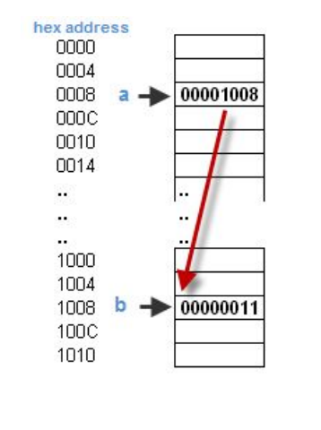

# Указатель


***Указатель*** <mark>pointer</mark> - переменная, диапазон значений которой состоит из ***адресов ячеек памяти*** и специального значения – **нулевого адреса**.
- ***Указатель*** *«указывает»* хранящимся внутри него **адресом** на ячейку памяти, к которой с его помощью можно обратиться.
- Значение **нулевого адреса** используется только для обозначения того, что ***указатель*** в данный момент **не указывает** ни на какую *ячейку памяти*.
- Для *определения* ***указателя*** надо указать *тип* объекта, на который **указывает указатель**, и символ звездочки `*`:
	`type* pointer_name;`
	- Пока данный ***указатель*** *не ссылается* ни на какой объект и хранит **случайное значение**.
	 - Но также можно инициализировать ***указатель*** некоторым значением:
	 - `type* pointer_name{};` или `type* pointer_name{nullptr}` или `type* pointer_name = nullptr;`
	 - Если ***указатель*** *ссылается* не на *член класса* или *функцию*, то размер значения ***указателя*** (хранимый адрес) не зависит от типа указателя. Он зависит от конкретной **платформы**. На *32-разрядных* платформах размер **адресов** равен 4 байтам, а на *64-разрядных* - 8 байтам.
	- Если ***указатель*** *ссылается* на *член класса*, то они хранят не только адрес, но и **информацию о смещении** внутри класса (особенно при множественном наследовании или виртуальных функциях).
		***Размер***:
		- В *64-битных* системах обычно **16 байт** (два 64-битных значения: смещение + дополнительная информация).   
		- В *32-битных* системах — **8 байт** (два 32-битных значения).
	- Если ***указатель*** *ссылается* на функцию, то в обычном случае в большинстве современных 64-битных систем занимают **8 байт** (как и указатели на данные), но **не всегда**!
		***Особые случаи***:
		 - В **сегментированных архитектурах** (например, 16-битные x86) указатель на функцию может быть **4 байта** (селектор сегмента + смещение), тогда как указатель на данные — 2 байта.
	    - В **экзотических системах** (например, микроконтроллеры) размер может быть нестандартным.
        
    - Указатели на **виртуальные функции** или **методы с множественным наследованием** могут требовать дополнительной информации для разрешения адреса.
- Поскольку **указатель** является *объектом*, то на него тоже можно сослаться, т. е. создать ***указатель на указатель***.
	Создается образом, аналогичным созданию обычного указателя:
	`type** ptr;`
	***Пример***:
	
```Cpp
int i = 0;
std::cout << "Value: " << i << " Address: " << &i << std::endl;

int* pi = &i; std::cout << "Value: " << pi << " Address: " << &pi << std::endl;

int** ppi = π std::cout << "Value: " << ppi << " Address: " << &ppi << std::endl;

int*** pppi = &ppi; std::cout << "Value: " << pppi << " Address: " << &pppi << std::endl;
```
- `pi` - *указатель* на `i` (хранит **адрес** `i`)
- `ppi` - *указатель* на `pi` (хранит **адрес** `pi`)
- `pppi` - *указатель* на `ppi` (хранит **адрес** `ppi`)

> Есть два основных вида _переменных_:
> - ***Глобальные*** и ***статические*** — их **адреса** известны во время ***линковки*** (или [задаются один раз при запуске приложения](https://en.wikipedia.org/wiki/Relocation_(computing)#Load-time)), и в каком-то виде зашиваются прямо в код, который к ним обращается.
> - На ***стеке*** — в одном из *регистров* обычно хранится **указатель** на верхушку стека, а к переменным обращаются по **смещению относительно этого указателя**. Смещение зашивается в код, который к ним обращается.
>  
> 	Либо такие **переменные** могут быть соптимизированы и храниться в *регистрах*, тогда в код зашивается, какой именно это *регистр*.
>  
> **Объекты** в куче не являются *переменными*, потому что у них нет **имен** (грубо говоря). И для них нет какого-то автоматического вычисления **адреса**. К ним можно обратиться только через **указатель** вручную (так же, как можно обратиться к любому другому объекту).

- ***<u>Приведение к типу указателя</u>***:
	Если есть ***указатель***, то его можно *приветсти* к другому типу:
	-  **Неявное** приведение.
	```Cpp
	void* unknown_ptr = ...;
	int* int_ptr = (int *)unknown_ptr;
	```
	- **Явное** приведение.
	```Cpp
	int value = *reinterpret_cast<int*>(ptr);
	```
	После *приведения* к другому типу можно использовать **раизменование** `*`.
	***Пример***:
	```Cpp
	int num = 42;
	void* ptr = #  // Указатель void* хранит адрес num
	
	// Приведение к int* и разыменование:
	int value = *(int *)ptr;
	std::cout << value;  // Выведет 42
	```

### Операторы `&` и `*`
- *Унарный* оператор `&` выдает **адрес** объекта.
- *Унарный* оператор `*` есть оператор *косвенного доступа*.
	С помощью него можно обратиться к содержимому *ячейки памяти*, на которую указывает **указатель**.

***Пример:***
```Cpp
int x = 1;
int y = 2;
int z[10];
int* ip;    /* ip - указатель на int */

ip = &x;    /* теперь ip указывает на x */
y = *ip;    /* y теперь равен 1 */
*ip = 0;    /* x теперь равен 0 */
ip = &z[0]; /* ip теперь указывает на z[0] */
```


### NULL и nullptr
- `NULL` ***макрос***. Использовался в языке ***С*** для указателя ни на что.
- `nullptr` ***литерал*** типа ***nullptr_t***. Имеет тот же смысл, но не приводит к неоднозначностям.
